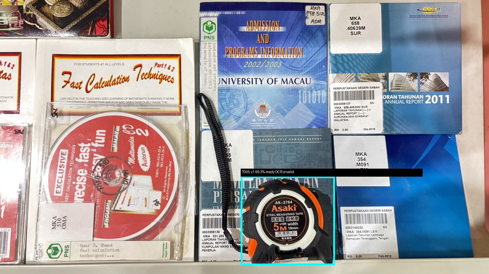
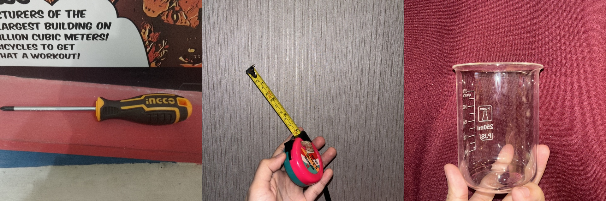
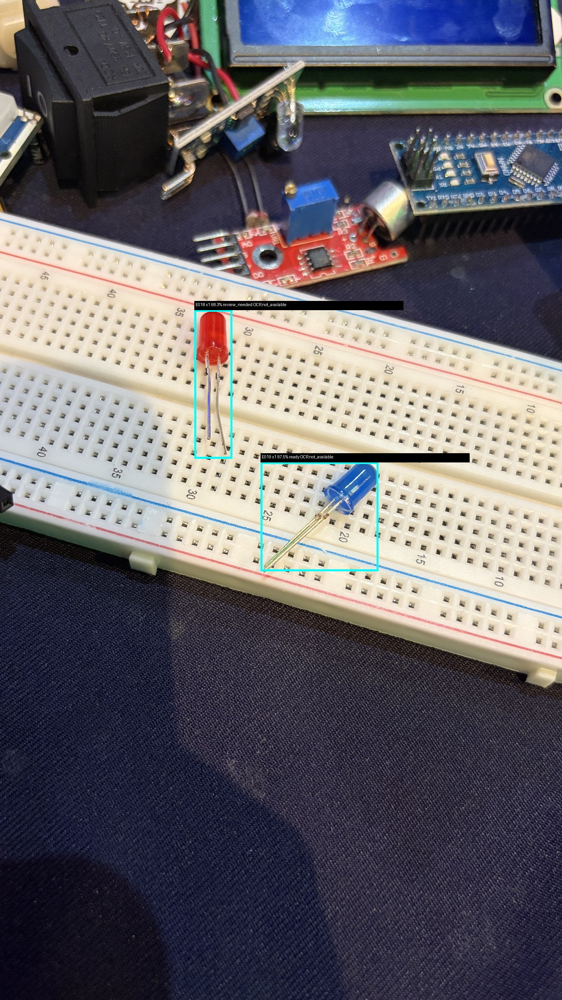

# ORBIT AI

Operational Recognition & Bulk Inventory Tracking

See it. Verify it. Track it. Anywhere.

**Competition:** Petrosains AI Innovators Challenge 2026 - Stage 1
**Team:** YKPZ 1 - Universiti Teknologi Malaysia

**Demo Video:** [https://youtu.be/XqnYcnUVp6I](https://youtu.be/XqnYcnUVp6I)
**Live App:** Coming soon / not publicly deployed

## Executive Summary

Petrosains operates a 109-item inventory catalogue across real storeroom environments. ORBIT AI is an operations-first inventory system for check-out, live availability, and mixed-item bulk return, designed so storeroom users can move quickly without losing traceability.

The system is offline-first because Stores 3-4 may not always have reliable internet. Users can keep working, save transactions locally, and synchronize safely after reconnect. The backend uses idempotent transaction processing so retries do not accidentally change inventory twice.

ORBIT AI combines object detection, OCR evidence, confidence-aware logic, and human review. AI predictions create reviewable proposals; inventory is changed only by confirmed transactions. Uncertain AI output never directly mutates stock.

The operational catalogue contains **109 item types**. The current real computer-vision prototype is validated on **five trained classes only**:

- T003 Screwdriver
- T005 Measure Tape
- L003 Beaker 250ml
- E018 LED Red
- E019 LED Blue

## Key Features

- Real AI-assisted check-out
- Live inventory availability
- Mixed-item bulk return
- Human-in-the-loop review
- Quantity correction
- Confidence-aware decision logic
- OCR evidence
- Offline queue + reconnect synchronization
- Activity / audit trail
- Inventory integrity protection
- 109-item operational catalogue

## Measured Results

Independent 5-class held-out test set:

| Metric | Result |
|---|---:|
| Precision | 79.6% |
| Recall | 74.7% |
| mAP@0.50 | 73.8% |
| mAP@0.50:0.95 | 61.9% |

Real local scan performance: approximately **2.0 seconds** including YOLO + OCR in the measured run. The local CPU benchmark reports a 20-run mean of 1.46 seconds for `/api/scans` and a P95 of 2.31 seconds.

These results apply only to the five validated computer-vision classes. They do not imply recognition across all 109 catalogue items.

## Demo Evidence

The verified competition demo flow shows:

1. **AI Check-out** - Measure Tape `T005` detected at approximately 99% confidence.
2. **Live Availability** - `T005` available quantity updates after confirmed checkout.
3. **Mixed-item Bulk Return** - one scene contains Beaker 250ml, Screwdriver, and Measure Tape.
4. **Failure & Recovery** - the detector initially produced Qty 3 for one physical Screwdriver due to overlapping detections. Human Review corrected Qty 3 to Qty 1.
5. **Final Verified Return** - Beaker 250ml x1, Screwdriver x1, Measure Tape x1.
6. **Offline-first** - a transaction can be saved locally while offline and synchronized after reconnect.

Existing evidence:







Additional reproducible records are in [`docs/performance/evidence/`](docs/performance/evidence/) and [`docs/performance/performance-report.md`](docs/performance/performance-report.md).

## Architecture

```text
Browser UI
  -> FastAPI
  -> YOLO11n detection
  -> RapidOCR evidence
  -> confidence / SKU mapping
  -> human review when needed
  -> transaction layer
  -> SQLite inventory
  -> activity audit trail
```

Offline path:

```text
Browser local queue
  -> reconnect
  -> /api/sync
  -> idempotent transaction processing
```

AI proposes. Human users confirm uncertain cases. Transactions mutate inventory. Raw AI predictions alone do not mutate inventory.

## Responsible AI

AI recommends. Humans remain in control. Every inventory decision is traceable.

- Low-confidence results require review.
- Duplicate or overlapping detections can be corrected before return.
- Invalid returns are blocked by inventory rules.
- OCR does not blindly override confident visual detections.
- Prototype limitations are disclosed: the current real model is validated on five classes, not all 109 catalogue items.

## Tech Stack

| Area | Stack |
|---|---|
| Frontend | Next.js / React / TypeScript |
| Backend | FastAPI / Python |
| Computer Vision | Ultralytics YOLO11n / PyTorch |
| OCR | RapidOCR / ONNX Runtime |
| Database | SQLite |
| Offline | Browser local queue + idempotent sync |

## Quick Start

These commands are for local Windows development from the repository root.

### 1. Install base dependencies

```powershell
python -m venv .venv
.\.venv\Scripts\python.exe -m pip install -r backend\requirements.txt
pnpm install --frozen-lockfile
.\.venv\Scripts\python.exe backend\scripts\reset_demo.py
```

### 2. Run in Mock mode

Mock mode starts quickly and does not require YOLO/OCR packages.

```powershell
.\.venv\Scripts\python.exe -m uvicorn app.main:app --app-dir backend --reload --port 8000
```

In a second terminal:

```powershell
pnpm dev
```

Open `http://localhost:3000`. API documentation is available at `http://127.0.0.1:8000/docs`.

### 3. Run Real YOLO + OCR mode

Install the validated CPU ML/OCR stacks:

```powershell
.\.venv\Scripts\python.exe -m pip install -r backend\requirements-ml.txt
.\.venv\Scripts\python.exe -m pip install -r backend\requirements-ocr.txt
```

Start the backend with real detection:

```powershell
$env:ORBIT_DETECTOR_MODE="real"
$env:ORBIT_MODEL_WEIGHTS="backend/models/orbit_ai_5class_yolo11n_best.pt"
$env:ORBIT_OCR_ENABLED="true"
.\.venv\Scripts\python.exe -m uvicorn app.main:app --app-dir backend --port 8000
```

Useful local checks:

```powershell
curl http://127.0.0.1:8000/api/health
.\.venv\Scripts\python.exe -m pytest backend\tests -q
pnpm.cmd exec next build --webpack
```

## API Surface

| Method | Path | Purpose |
|---|---|---|
| GET | `/api/health` | Database, detector, and OCR status |
| GET | `/api/inventory` | Search, filter, and paginate inventory |
| GET | `/api/inventory/{item_id}` | Item detail, unit rules, store, and recent transactions |
| GET | `/api/stores` | Stable store IDs and connectivity |
| POST | `/api/scans` | Multipart image or raw JPEG/PNG scan |
| GET | `/api/scans/{scan_id}` | Restore a scan after refresh |
| POST | `/api/scans/{scan_id}/reviews/{detection_id}` | Confirm, choose another, rescan, or reject |
| POST | `/api/transactions/checkout` | Atomic idempotent checkout |
| POST | `/api/transactions/returns` | Atomic idempotent reviewed return |
| GET | `/api/activity` | Transaction audit history |
| POST | `/api/sync` | Offline replay and conflict-safe synchronization |

## Testing

Current validation evidence includes:

- Backend tests: **20 passed**
- Independent 5-class computer-vision evaluation
- Real checkout end-to-end test
- Mixed-item bulk return
- Human review flow
- Quantity correction
- Offline/reconnect behavior
- Inventory integrity guard
- Production build evidence in [`docs/performance/evidence/production-build.txt`](docs/performance/evidence/production-build.txt)
- TypeScript validation evidence in [`docs/performance/evidence/typecheck.txt`](docs/performance/evidence/typecheck.txt)

## Important Project Data

- Normalized operational catalogue: [`backend/data/inventory_catalog.json`](backend/data/inventory_catalog.json)
- Five-class model weights: [`backend/models/orbit_ai_5class_yolo11n_best.pt`](backend/models/orbit_ai_5class_yolo11n_best.pt)
- Detector/OCR model card: [`docs/model-card.md`](docs/model-card.md)
- Local CPU performance report: [`docs/performance/performance-report.md`](docs/performance/performance-report.md)
- Data audit: [`docs/data-audit/audit-report.md`](docs/data-audit/audit-report.md)
- Backend integration report: [`docs/backend-integration-report.md`](docs/backend-integration-report.md)
- Phase completion report: [`docs/phase-completion-report.md`](docs/phase-completion-report.md)

## Limitations & Next Steps

Current limitations:

- Real CV is validated on five classes, not all 109 catalogue items.
- LED classes are more challenging.
- Real-world clutter, overlap, lighting, and small items can reduce confidence.
- Public cloud deployment is not currently provided.

Next steps:

- Expand the dataset toward all 109 operational classes.
- Collect more real Petrosains imagery.
- Improve duplicate suppression and quantity estimation.
- Strengthen small-item recognition.
- Package local inference for offline stores.

## Credits / AI Usage

ORBIT AI uses Ultralytics YOLO11n, PyTorch, RapidOCR, ONNX Runtime, FastAPI, SQLite, Next.js, and React.

OpenAI ChatGPT / Codex assisted with coding, debugging, testing, documentation, and presentation preparation. Generated suggestions were reviewed and validated by the team.
