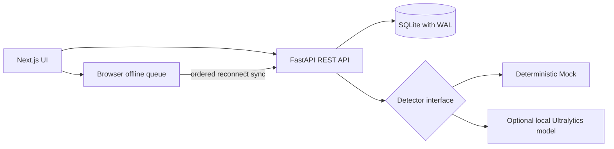

# ORBIT AI — Petrosains Inventory System

ORBIT AI is a local-first inventory prototype for the AI Innovators Challenge. It tracks the official 109 inventory types across five categories and four storerooms, supports checkout and camera-led bulk return, routes uncertain detections to human review, and prevents duplicate stock changes during reconnect or retry.

## Architecture



Inventory never changes from raw AI output. A scan creates reviewable proposals; checkout or return changes stock only after a confirmed, atomic transaction. The browser creates `client_transaction_id` before sending, preserves offline payloads in `localStorage`, and removes them only after the server reports `applied` or `duplicate`.

## Run on Windows

From the repository root:

```powershell
python -m venv .venv
.\.venv\Scripts\python.exe -m pip install -r backend\requirements.txt
pnpm install --frozen-lockfile
.\.venv\Scripts\python.exe backend\scripts\reset_demo.py
```

Start the backend in one terminal:

```powershell
.\.venv\Scripts\python.exe -m uvicorn app.main:app --app-dir backend --reload --port 8000
```

Start the frontend in a second terminal:

```powershell
pnpm dev
```

Open `http://localhost:3000`. API documentation is at `http://127.0.0.1:8000/docs`. Defaults are in `.env.example`; no secret is required for Mock mode.

## Test and reset

```powershell
.\.venv\Scripts\python.exe -m pytest backend\tests -q
.\node_modules\.bin\tsc.cmd --noEmit
.\node_modules\.bin\next.cmd build
.\.venv\Scripts\python.exe backend\scripts\reset_demo.py
```

The reset is deterministic. It imports the official catalog and simulates seven outstanding Store 1 units so the Bulk Return fixture can return them without allowing available stock to exceed total stock.

## API

| Method | Path | Purpose |
|---|---|---|
| GET | `/api/health` | Database and detector status |
| GET | `/api/inventory` | Search/filter/paginate inventory |
| GET | `/api/inventory/{item_id}` | Item, unit rules, store, recent transactions |
| GET | `/api/stores` | Stable store IDs and connectivity |
| POST | `/api/scans` | JSON fixture, multipart image, or raw JPEG/PNG scan |
| GET | `/api/scans/{scan_id}` | Restore a scan after refresh |
| POST | `/api/scans/{scan_id}/reviews/{detection_id}` | Confirm, choose another, rescan, or reject |
| POST | `/api/transactions/checkout` | Atomic idempotent checkout |
| POST | `/api/transactions/returns` | Atomic idempotent reviewed return |
| GET | `/api/activity` | Transaction audit history |
| POST | `/api/sync` | Per-operation offline replay/conflict result |

The initial confidence policy is configurable: ready at `>= 0.85`, human review at `0.60–0.8499`, and unknown below `0.60`. These are demo thresholds, pending calibration against an annotated validation set.

## Official data and computer vision

The normalized inventory seed is `backend/data/inventory_catalog.json`. It keeps official SKU, name, category, location, quantity, unit, rack, and AI class key. `backend/scripts/import_official_inventory.py` reproduces it from the official workbook.

The resource audit under `docs/data-audit/` covers every supplied inventory and storeroom photo without copying the 6.46 GB source set into Git. It records formats, image metrics, duplicate components, fixed class mapping, lookalikes, and a leakage-controlled split.

The official photos currently have image-level folder labels but no bounding boxes, instance counts, negative scenes, or capture-session metadata. They are suitable for exploration and assisted annotation; they are not yet an honest evaluation set for multi-object detection/counting. `backend/app/detectors/real.py` is ready for a local Ultralytics model once reviewed annotations and weights exist. Set `ORBIT_DETECTOR_MODE=real` and `ORBIT_MODEL_WEIGHTS` to swap it in without changing the UI or REST contract.

## Five-minute demo path

1. Reset the database and open Inventory to show 109 official item types.
2. Check out one Store 1 item and refresh Inventory/Activity to show persistence.
3. Start Bulk Return. The deterministic fixture finds three ready lines and one red/blue LED review.
4. Explain the confidence and visual ambiguity, confirm the human choice, then confirm the return.
5. Double-click/retry the same client transaction to show a replay without another stock change.
6. Disconnect external internet and continue against the local backend; optionally stop the backend to demonstrate `Saved Offline`, restart it, and use System → Sync all now.

See [backend integration report](docs/backend-integration-report.md), [completion report](docs/phase-completion-report.md), and [data audit](docs/data-audit/audit-report.md).
