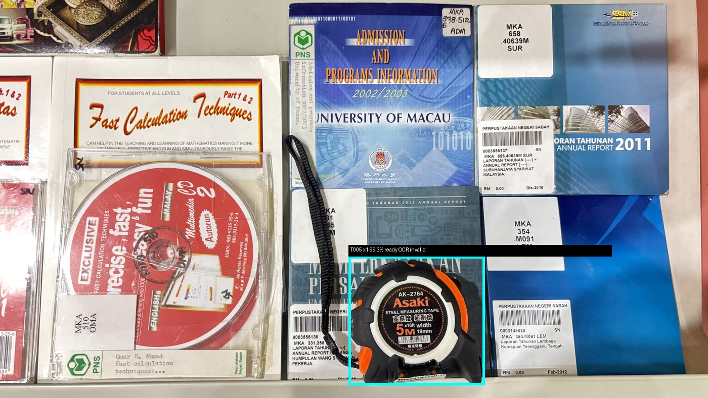
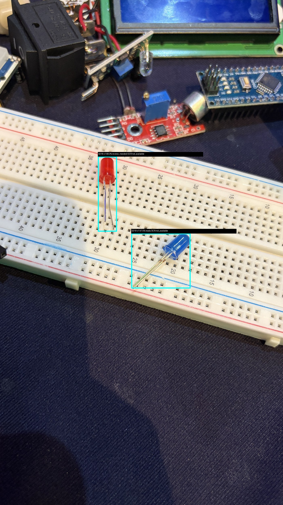

# ORBIT AI

**Operational intelligence for Petrosains inventory and programme planning**

> See it. Verify it. Plan it. Track it.

**Competition:** Petrosains AI Innovators Challenge 2026 — Finals
**Team:** YKPZ 1 — Universiti Teknologi Malaysia
**Demo Video:** https://youtu.be/XqnYcnUVp6I
**Live App:** Local finals build / not publicly deployed

---

## What ORBIT AI Does

ORBIT AI combines two connected layers:

1. **Inventory Operations** — AI-assisted checkout, mixed-item bulk return, live stock, offline sync, and auditability.
2. **Programme Twin** — a grounded AI-powered programme consultant that converts stakeholder requests into practical programme plans using the official Petrosains catalogue only.

The finals idea is simple: **planning should understand operational reality**. A programme recommendation is more useful when it can be checked against constraints, resources, uncertainty, and the inventory workflow that will eventually support execution.

```text
Stakeholder Request
      ↓
Programme Twin
      ↓
Official Catalogue Reasoning
      ↓
Multi-theme Coverage + Constraints
      ↓
Resource Feasibility + Unknowns
      ↓
Participant Journey + Plan B
      ↓
Approved Programme
      ↓
ORBIT Inventory Operations
Checkout → Return → Audit
```

---

## Finals Extension — Programme Twin

The Programme Twin extends the Stage 1 inventory system into an **AI-Powered Programme Consultant**.

It can:

- interpret themes, objectives, audience, participant count, age, duration, venue, internet conditions, and extra context;
- recommend from the **21 official catalogue offerings only**;
- support **multiple themes and objectives** instead of forcing a single-theme answer;
- explain why each activity fits the request;
- check practical constraints such as capacity, duration, venue, utilities, staffing-related unknowns, and materials;
- distinguish between **verified facts, assumptions, and items needing verification**;
- produce a cohesive participant journey rather than a disconnected activity list;
- surface **Plan B / trade-offs** when constraints create risk;
- propose clearly labelled enhancements without pretending they are official catalogue offerings;
- save favourite programmes and activities locally in the browser;
- export a print-friendly programme report.

### Grounding Rules

Programme Twin is intentionally conservative:

- It **does not invent Petrosains offerings**.
- It says when information is missing.
- It does not treat current inventory quantity as guaranteed future booking availability.
- It does not assume future staffing, room availability, utilities, safety approval, or kit availability.
- Adapted timings are labelled as **PROPOSED ENHANCEMENT — Adapted Format**.
- If no suitable programme can be supported, it should say so instead of fabricating an answer.

---

## Inventory Operations

The Stage 1 operational layer remains the execution backbone.

### Core Capabilities

- AI-assisted checkout
- Camera capture and image upload
- Mixed-item bulk return
- Human-in-the-loop review
- Quantity correction before inventory mutation
- Manual fallback for out-of-scope catalogue items
- Live inventory availability
- Activity trail with signed quantity deltas
- OCR evidence
- Offline queue + reconnect synchronization
- Idempotent transaction processing
- Inventory integrity protection

The operational catalogue contains **109 item types**.

The current real computer-vision prototype is trained for **five classes**:

| Class | Item |
|---|---|
| T003 | Screwdriver |
| T005 | Measure Tape |
| L003 | Beaker 250ml |
| E018 | LED Red |
| E019 | LED Blue |

Items outside these trained classes can still use the existing catalogue through the manual fallback flow.

### AI Safety Principle

**AI proposes. Humans confirm uncertain cases. Transactions mutate inventory. Raw AI predictions do not directly change stock.**

---

## Confidence-Aware Vision Flow

```text
Image / Camera
      ↓
YOLO11n Detector
      ↓
OCR Evidence
      ↓
Confidence + SKU Mapping
      ↓
Ready / Review Needed / Unknown
      ↓
Human Review when required
      ↓
Confirmed Transaction
      ↓
Inventory + Activity Audit
```

The prototype uses confidence-aware routing so uncertain detections remain reviewable before stock is changed.

Recorded local CPU scan performance is approximately **2.0 seconds end-to-end** in the measured run. The existing 20-run `/api/scans` benchmark recorded a mean of **1.46 s** and P95 of **2.31 s**. See `docs/performance/` for the recorded evidence and context.

---

## Offline-First Design

ORBIT AI is designed for storeroom operations where connectivity may be unstable.

```text
Browser Local Queue
      ↓
Reconnect
      ↓
/api/sync
      ↓
Idempotent Transaction Processing
      ↓
Inventory + Audit Trail
```

A `client_transaction_id` and payload checks protect against accidental duplicate inventory changes when a queued request is retried.

---

## Finals Demo Flow

### A. Inventory Operations

1. Capture or upload an item image.
2. Run real detection.
3. Confirm high-confidence results or review uncertain ones.
4. Checkout or bulk-return items.
5. Verify the inventory quantity change.
6. Verify the signed delta and before → after quantity in Activity.
7. Demonstrate manual fallback for an out-of-scope item when needed.

### B. Programme Twin

1. Enter a stakeholder brief with multiple themes/objectives.
2. Review ORBIT's interpretation of the request.
3. Build the programme from the official catalogue.
4. Inspect the recommended journey, feasibility checks, unknowns, and trade-offs.
5. Save a favourite programme/activity.
6. Export the programme report.
7. Connect the approved plan back to the existing inventory execution layer.

---

## Architecture

### Application

| Layer | Technology |
|---|---|
| Frontend | Next.js / React / TypeScript |
| Backend | FastAPI / Python |
| Computer Vision | Ultralytics YOLO11n / PyTorch |
| OCR | RapidOCR / ONNX Runtime |
| Database | SQLite (WAL) |
| Offline | Browser queue + idempotent sync |
| Programme Twin | Grounded catalogue reasoning + constraint / feasibility engine |

### Main Operational APIs

| Method | Path | Purpose |
|---|---|---|
| GET | `/api/health` | Database, detector, and OCR status |
| GET | `/api/inventory` | Search/filter inventory |
| GET | `/api/inventory/{item_id}` | Item detail and history |
| GET | `/api/stores` | Store connectivity |
| POST | `/api/scans` | Checkout / return scan |
| GET | `/api/scans/{scan_id}` | Restore scan state |
| POST | `/api/scans/{scan_id}/reviews/{detection_id}` | Human review |
| POST | `/api/transactions/checkout` | Atomic idempotent checkout |
| POST | `/api/transactions/returns` | Atomic reviewed return |
| GET | `/api/activity` | Audit history |
| POST | `/api/sync` | Offline replay / synchronization |

### Programme APIs

| Method | Path | Purpose |
|---|---|---|
| GET | `/api/programmes/offerings` | Official programme offerings |
| GET | `/api/programmes/themes` | Supported theme information |
| POST | `/api/programmes/consult` | Build grounded programme recommendation |

---

## Quick Start

Commands below assume Windows and repository root.

### 1. Install

```powershell
python -m venv .venv
.\.venv\Scripts\python.exe -m pip install -r backend\requirements.txt
pnpm install --frozen-lockfile
.\.venv\Scripts\python.exe backend\scripts\reset_demo.py
```

### 2. Run Backend

Mock / lightweight mode:

```powershell
.\.venv\Scripts\python.exe -m uvicorn app.main:app --app-dir backend --reload --port 8000
```

Real YOLO + OCR mode:

```powershell
.\.venv\Scripts\python.exe -m pip install -r backend\requirements-ml.txt
.\.venv\Scripts\python.exe -m pip install -r backend\requirements-ocr.txt

$env:ORBIT_DETECTOR_MODE="real"
$env:ORBIT_MODEL_WEIGHTS="backend/models/orbit_ai_5class_yolo11n_best.pt"
$env:ORBIT_OCR_ENABLED="true"
.\.venv\Scripts\python.exe -m uvicorn app.main:app --app-dir backend --port 8000
```

### 3. Run Frontend

Development:

```powershell
pnpm dev
```

Production-style local finals build:

```powershell
pnpm build --webpack
pnpm start
```

Open:

- App: `http://localhost:3000`
- Programme Twin: `http://localhost:3000/programme`
- API docs: `http://127.0.0.1:8000/docs`

---

## Validation

Finals integration validation includes:

- **214 / 214 Programme Twin checks passing**
- **22 / 22 backend tests passing**
- TypeScript validation: `pnpm typecheck`
- Production build: `pnpm build --webpack`
- Programme route generated successfully
- Real checkout flow
- Mixed-item bulk return
- Human review and quantity correction
- Manual fallback
- Offline/reconnect behaviour
- Inventory integrity guards
- Activity audit trail with quantity deltas

Useful commands:

```powershell
node tests\programmes\run-b6-tests.cjs
.\.venv\Scripts\python.exe -m pytest backend\tests -q
pnpm typecheck
pnpm build --webpack
git diff --check
```

---

## Evidence & Project Data

- Inventory catalogue: `backend/data/inventory_catalog.json`
- Five-class model weights: `backend/models/orbit_ai_5class_yolo11n_best.pt`
- Model card: `docs/model-card.md`
- Performance report: `docs/performance/performance-report.md`
- Performance evidence: `docs/performance/evidence/`
- Data audit: `docs/data-audit/audit-report.md`
- Backend integration report: `docs/backend-integration-report.md`
- Phase completion report: `docs/phase-completion-report.md`

Existing Stage 1 visual evidence:






---

## Responsible AI & Limitations

ORBIT AI is designed to expose uncertainty instead of hiding it.

Current limitations:

- Real CV is trained on five classes, not all 109 inventory items.
- Recognition can degrade with clutter, overlap, lighting, or very small objects.
- Programme Twin is grounded to the available official catalogue data; it cannot verify facts that are absent from that data.
- Current inventory quantity is not treated as guaranteed future programme availability.
- Staffing, rooms, safety approval, utilities, and future material availability may still require operational verification.
- Saved favourites are browser-local and are not synchronized across devices.
- Public cloud deployment is not currently provided.

Next steps include expanding the vision dataset, strengthening small-item recognition, connecting approved programme plans more deeply to future resource reservation, and packaging local inference for offline deployment.

---

## Credits / AI Usage

ORBIT AI uses Ultralytics YOLO11n, PyTorch, RapidOCR, ONNX Runtime, FastAPI, SQLite, Next.js, and React.

OpenAI ChatGPT / Codex assisted with coding, debugging, testing, documentation, and presentation preparation. Generated suggestions were reviewed and validated by the team.

---

**ORBIT AI — from seeing inventory to planning programmes with operational truth.**
